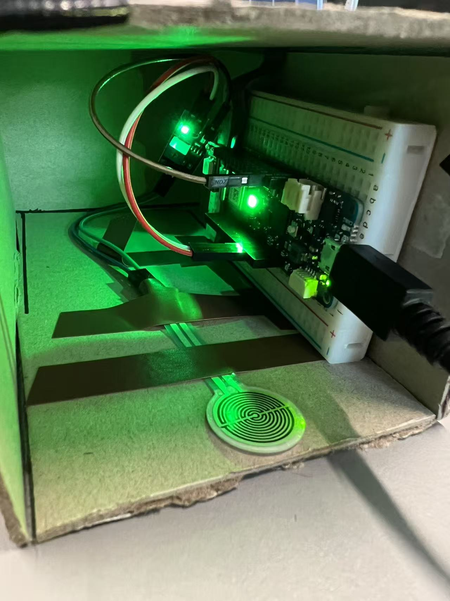
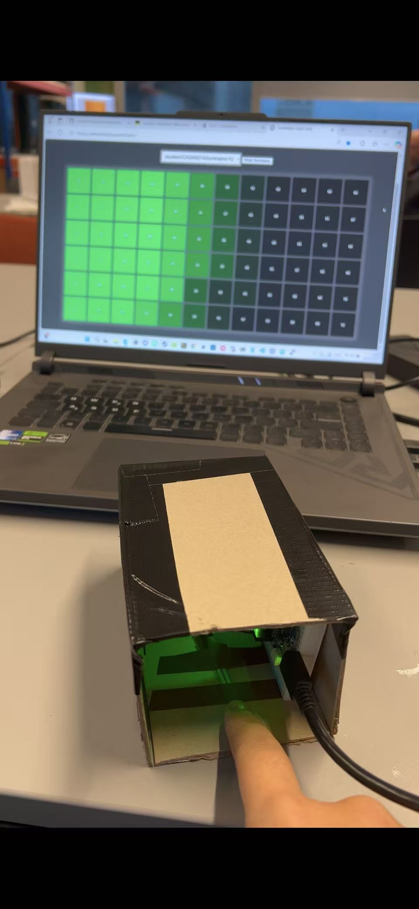

# Pressure Light

  

The inspiration for this project comes from pressure balls. When you are under a lot of stress, you might as well press it. As you watch the lights flicker, which reflect the intensity and emotions, your stress will be relieved to a great extent.

## Project Overview
This project is based on the Arduino MKR1010 development board and a pressure sensor, and realizes an interactive LED ring control system via Wi-Fi. When the user applies different pressures to the sensor, the number of illuminated LEDs on the LED strip will increase accordingly, and the color of the lights will gradually change from green → yellow → red to visually reflect the pressure intensity. This system demonstrates the process of sensor signal acquisition, data smoothing processing, and MQTT communication.

## Component Breakdown

Arduino MKR1010: It reads the analog signal from the FSR pressure sensor and sends the RGB color data to the Vespera lighting system via the MQTT protocol.

Vespera: A WiFi-enabled luminaire that can be controlled via MQTT messages.

FSR402(Force Sensitive Resistor) with linear voltage conversion module: This sensor converts physical pressure into an analog voltage value.

  

Web Visualise: A web-based interface that mimics the output sent to Vespera. 

  

## How it works

The process can be divided into five stages:

1.Pressure detecting: The FSR sensor is used to detect the physical pressure level. When the user applies pressure, the resistance of the sensor changes, then outputting an analog voltage signal within the range of 0 to 4095.

2.Analog Data Processing: MKR1010 reads sensor data through the analogRead() function. The original signal is processed using the Exponential Moving Average (EMA) algorithm, with the calculation formula as follows: emaVal = α × new value + (1 - α) × old value. This algorithm reduces interference, making the changes in the lighting more stable.

3.Mapping Pressure to Light：The smoothed data is mapped onto two dimensions: the number of LED lit and the change in light color. Thus, the intensity of the pressure applied by the user can be directly reflected through the brightness and color of the lights.

4.MQTT Communication：The processed RGB data is sent to the Vespera system via the MQTT protocol, and the system achieves real-time data transmission through Wi-Fi.

5.Visual Feedback：After receiving the RGB byte array, Vespera immediately updates the LED color, achieving a real-time visualization effect of pressure changes.

## Future development

In the future, I hope to change the form of this project so that it can truly become a "ball". This would provide a better release-pressure feeling. However, it also means that we might need to use something like an blood pressure pump to accurately measure the grip strength, and at the same time, apply sound effects to assist in the stress relief.

#
### Chaoshuo Han
